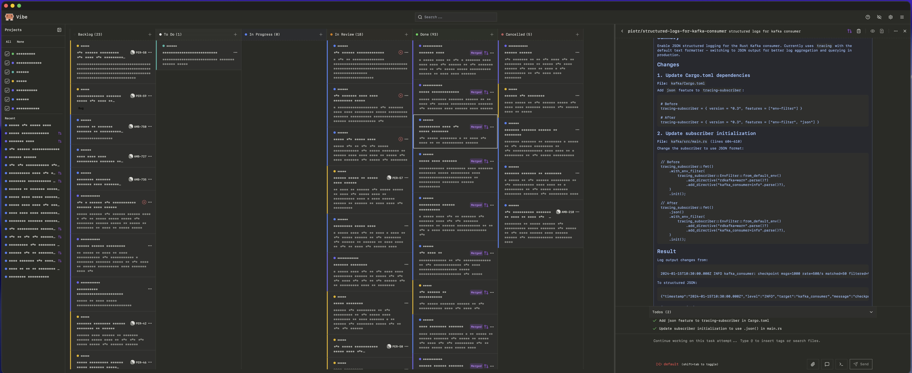

<p align="center">
  
</p>

<p align="center">AI agent orchestration for coding tasks</p>

<p align="center">
  
</p>

Fork of [BloopAI/vibe-kanban](https://github.com/BloopAI/vibe-kanban).

## What's Different

- Tauri desktop app for macOS (native menu bar)
- Native system notifications
- Privacy mode (screenshot-safe UI)
- Linear integration (bidirectional sync with labels and issue IDs)
- GitHub PR status badges and PR binding
- No analytics or tracking
- Gruvbox theme + Liga SFMono font
- PWA support (installable web app)
- Unified task board with project filter sidebar
- Claude Code-style tool call rendering

## Install

Desktop (macOS):

```bash
task desktop-install
```

Development:

```bash
task dev
```

Production build:

```bash
task start
```

## Development

Prerequisites:

- [Rust](https://rustup.rs/) (latest stable)
- [Node.js](https://nodejs.org/) (>=18)
- [pnpm](https://pnpm.io/) (>=8)
- [Task](https://taskfile.dev/) (task runner)

Additional tools:

```bash
cargo install cargo-watch
cargo install sqlx-cli
cargo install tauri-cli
```

Key commands:

| Command | Description |
|---------|-------------|
| `task dev` | Hot-reload dev server (frontend + backend) |
| `task check` | Type-check frontend + backend |
| `task test` | Run Rust tests |
| `task lint` | Lint all code |
| `task format` | Format all code |
| `task build` | Production build |
| `task desktop-install` | Build and install macOS app |
